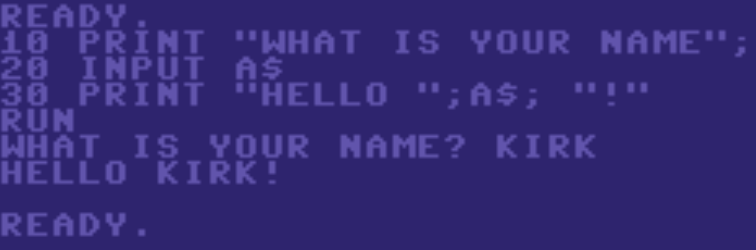
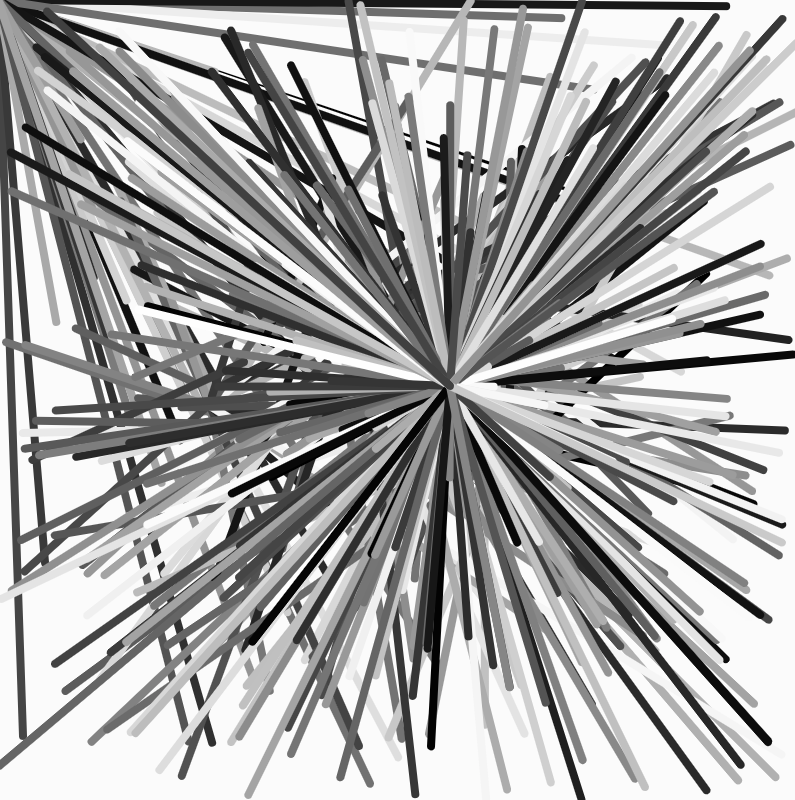

## Recreational Programming

If you were a "child of the '80s" in the USA,
there was a decent chance you had access to one of the 
8-bit home computers of the era - either at home or in the classroom or the local library. 
Most of those computers had a version of the programming language BASIC 
built-in. Even if the computer was mostly used to play games, you typed a 
BASIC command in order to load and run the game. There was a good chance you
had also learned a little bit of BASIC in class so that you could make your own
program, even if it was as simple as 

```
10 PRINT "WHAT IS YOUR NAME";
20 INPUT A$
30 PRINT "HELLO "; A$; "!"
```



These computers were primitive and slow by today's standards, but could still do many
cool things. Most versions of BASIC had commands for graphics and sound.
Kids learned they could have the full power of the machine at their command.
In fact, many professional games weren't much better than what an amateur 
could write at home.

Computers grew in power, ease-of-use, and connectivity,
but the sense of "just by typing, I can make this computer do interesting stuff" was diminished. 
Luckily, some amazing toolkits like [Processing](https://processing.org/) and its
JavaScript cousin [p5.js](https://p5js.org/) have appeared to recover those abilities - and 
CarGurus gave me a chance to teach that to some of my fellow "Gurus" and to the readers of this blog.

## Guru2Guru

CarGurus fosters its *culture of learning* with its Guru2Guru program: a collection
of peer-to-peer classes helping people in their professional development. For the summer, 
we created a more casual edition called *G2G After Hours* - single session
classes where topics could be more fun and less focused on our day-to-day jobs.
Topics included *Intro to Calligraphy*,
*Mixology*, *Knitting*, and *Photography Basics*...

My contribution was running a 2 hour class entitled *Making Virtual Toys, Games and Art*.  
Here was the description on the sign-up website:

>All developers know how to program for work… but what about for fun? 
>
>This class will show you how to make interactive toys and games in p5.js that will let you exercise different parts of 
>your programming toolset, or show you how to get a younger student on the road to coding. 
>
>Check out Kirk's [Penguin Game](https://advent2013.alienbill.com/pengogogo/) or [Interactive Artwork](https://advent2013.alienbill.com/paintbars/) to see some examples!
>
>Having some experience coding (any language) and basic understanding of conditionals, loops, and functions will help with this class, but is not mandatory.


I designed the class to let experienced developers experiment with a type of programming their day-to-day 
work might not cover, as well as to enable people who had never programmed before to dip their toes in the 
water in a supportive environment. (I encouraged the more experienced folks to pair up with the beginners 
who might be running into just how picky computers are for the first time.) The course was based on p5.js...

## Processing and p5.js

Processing was started in 2001 by Casey Reas and Ben Fry as a Java-based
"flexible software sketchbook and a language for learning how to code within the context of the visual arts."
Over the years I've created many [toys](https://toys.alienbill.com/) and [games](https://games.alienbill.com/advent/)
in it... it provided an excellent way to keep my Java skills from gathering too much rust when I was 
focused on developing in other languages.

When I began working with Processing in 2004, I was delighted by its ease of use &mdash; most environments require a lot of ceremony and boiler plate to do anything, but with Processing you can fire up the mini-IDE, type a few easy-to-remember statements, press the run button, and your program is off and running. Every command in its command list [reference page](https://processing.org/reference/) is a ready-to-run mini-program &mdash; encouraging quick experimentation and learning.

These days I suggest people use [p5.js](https://p5js.org/), the officially sanctioned JavaScript port. 
It shares the principles of being very low friction to start with: you can go to its [online editor](https://editor.p5js.org/) and enter the following code:

```js
function setup() {
  createCanvas(400, 400);
  strokeWeight(4);
}

function draw() {
  stroke(random(255));
  line(mouseX,mouseY,random(400),random(400));
}
```

If you do that and hit the run button - congratulations, you've just coded and run your first piece of p5.js interactive art!



There is enormous flexibility in that little canvas window Processing and p5.js provides - and more opportunities for dynamic, visually appealing interaction than what most day-to-day web programming offers. Plus, you can think beyond the canvas, with libraries for manipulating the webpage DOM and connecting to external hardware, such as the computers microphone or maybe even an external devices. Even if your goal is just to make a static infographic, these toolkits provide worlds of flexibility that a typical graphing library will not have. (CarGurus also used p5.js's ability to generate SVGs to script generating  a series of images - for example 100 images of a fuel gauge-like percentage meter.)

p5.js and its community provide all kinds of helpful information and support - to the extent that I worry my 2 hour workshop could be condensed into a 10 second version: "Go to the [p5.js page](https://p5js.org/), click around the "Learn" and "Web Editor" page, be brave and have fun!"

##Resources

* [Processing.org](https://Processing.org) and [p5js.org](https://p5js.org) contain lots of excellent starting material
* [OpenProcessing](https://openprocessing.org/) is a community site where people show off their own art and games, including the source code
* The [p5.js reference](https://p5js.org/reference/) is great, but potentially overwhelming at first - I created a [Good Parts Edition](http://kirkdev.blogspot.com/2019/08/p5-reference-good-parts-edition.html) that focuses on the commands that have proven most useful in my decade and a half of making virtual toys.